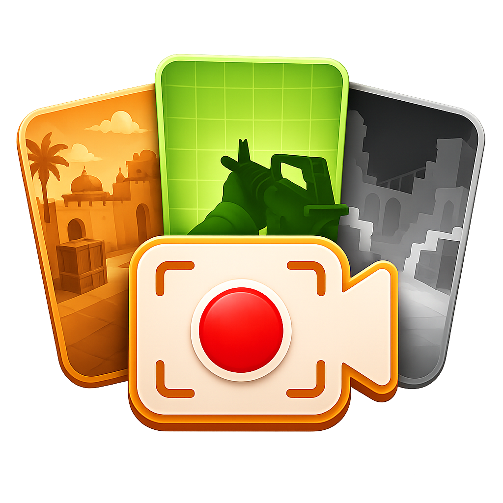

<p align="center">
  
</p>

<h1 align="center">CS:S V34 ADVANCED RECORDING TOOLS V1.0</h1>

<p align="center">Multi-pass capture, AdvancedFX-compatible camera tools, and After Effects utilities for Counter-Strike: Source v34 build 4044.</p>

> [!WARNING]
> ART loads a DLL into 32-bit `hl2.exe` and replaces engine vtable entries. Use it only for offline moviemaking, local playback, and demo rendering. Do not use it on secured or competitive servers.

## Features

- Synchronized `normal`, `clear`, `clear-noplayers`, `viewmodel`, `players`, `depth`, and `objectid` TGA passes.
- Independent pass/HUD switches, live preview, chroma colors, ObjectID colors, player isolation, and depth range (`150`–`800` by default).
- Bounded asynchronous TGA writing with uncompressed, automatic RLE, and forced RLE modes.
- Take folders, optional prefixes, JSON metadata, capture statistics, and background validation.
- Demo loading, seeking, Pause/Resume toggles, spectator controls, FOV tools, no-flash/no-smoke, demo-proof `r_lod` override, and flat chams.
- Integrated `mirv_campath`, `mirv_input`, CAM, AGR, BVH, and FOV commands with automatic take exports.
- In-game GUI (`Shift+F3`) with configs, take browser, console, output controls, and capture-excluded overlay.
- After Effects importer and time-remapped camera baker under `tools/after_effects`.

## Requirements

- Counter-Strike: Source v34, engine build 4044, 32-bit `hl2.exe`.
- Windows 10 or newer.
- Visual Studio 2022 with **Desktop development with C++** and a Windows 10/11 SDK when building from source.

The required build-4044 SDK headers and x86 libraries are included under `third_party/cssv34-sdk`.

## Build

From a fresh clone, run:

```text
build.bat
```

This builds `Release|Win32`, packages the release, and creates:

```text
dist/v34_art_v1.0.exe
dist/v34_art_v1.0.dll
dist/v34-art-v1.0.zip
```

Building `v34-art.sln` in Visual Studio also packages the ZIP after the Loader project finishes. See [Building](docs/BUILDING.md) for command-line options.

## Install and use

1. Extract `dist/v34-art-v1.0.zip`.
2. Keep `v34_art_v1.0.exe` and `v34_art_v1.0.dll` together.
3. Start CS:S and wait for the main menu or a demo to load.
4. Run the Loader, then press `Shift+F3`.

Minimal console workflow:

```text
host_framerate 300
art_record viewmodel on
art_record depth on
art_start shot01
// play the shot
art_stop
```

Default output is `cstrike/art/take0000`. Run `art_help` in-game or read the [command reference](docs/COMMANDS.md).

## After Effects

The release ZIP includes both tools in `Scripts`:

- `ART_Importer_v1.0.jsx` imports TGA/video/OpenEXR footage, metadata, cameras, and AGR tracks.
- `ART_Camera_Baker_v1.0.jsx` bakes a camera and nulls from a time-remapped ART precomp.

Copy the `.jsx` files to `Adobe After Effects <version>/Support Files/Scripts`, restart After Effects, then run them from **File > Scripts**. See [After Effects tools](docs/AFTER_EFFECTS.md).

## Documentation

- [Commands](docs/COMMANDS.md)
- [Building](docs/BUILDING.md)
- [After Effects tools](docs/AFTER_EFFECTS.md)
- [Troubleshooting](docs/TROUBLESHOOTING.md)
- [Third-party notices](THIRD_PARTY_NOTICES.md)

## Repository layout

```text
dll/          Recorder, render hooks, GUI, statistics, and HLAE bridge
loader/       Win32 Loader
scripts/      Build, package, and verification scripts
tests/        Source contracts and engine-independent tests
tools/        After Effects scripts
third_party/  Vendored build dependencies and licenses
```

## License

Original ART code and documentation are licensed under the [MIT License](LICENSE), copyright © 2026 Contrastniy. Vendored components retain their own terms; the included CS:S SDK notice states **NOT FOR COMMERCIAL PURPOSES**. See [THIRD_PARTY_NOTICES.md](THIRD_PARTY_NOTICES.md).

ART is independent and is not affiliated with or endorsed by Valve. Created by [Contrastniy](https://www.youtube.com/@Contrastniy).
